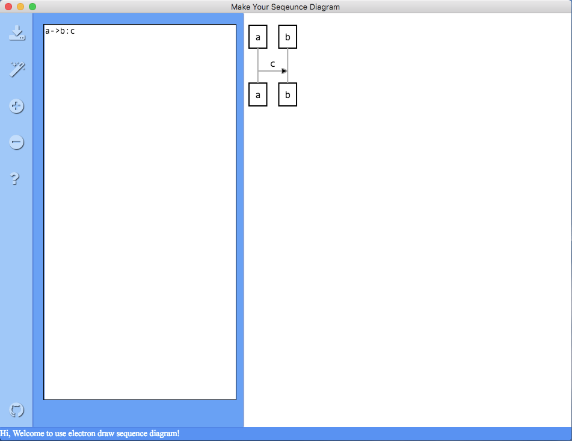

# electron-draw-sequence-diagram
Draw UML sequence diagrams on Desktop by Electron



## Download url

-   Windows :  [electron-draw-sequence-diagram.Setup.0.1.0.zip](https://github.com/sutaking/electron-draw-sequence-diagram/releases/download/v0.1.0/electron-draw-sequence-diagram.Setup.0.1.0.zip)
-   MacOS : [electron-draw-sequence-diagram-0.1.0.dmg](https://github.com/sutaking/electron-draw-sequence-diagram/releases/download/v0.1.0/electron-draw-sequence-diagram-0.1.0.dmg)


## Toto-List:
-   finish zoom in & zoom out.
-   add localstorage to save data.
-   resize textarea and svg-area


-------
Finish-List:
-   ~~save svg to png~~
-   ~~get input text~~
-   ~~layout ui with absolute~~
-   ~~download png file from electron~~
-   ~~add tool bar~~
-   ~~add status bar~~
-   ~~fix scrollbar show~~
-   ~~js-sequence help doc~~
-   ~~update ui style to material design~~
-   ~~ubuild app to dmg & exe~~u


## Quick-Start

````
yarn install
yarn dev &
yarn start
````


## About
-   [react-sequence-diagram](https://github.com/zfanta/react-sequence-diagram)
-   [canvg](https://github.com/canvg/canvg)